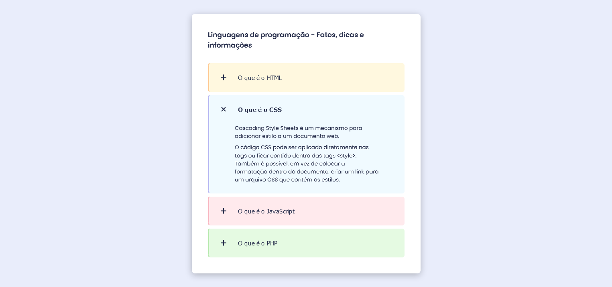

# colorful-accordion
Um simples repositório para treinar a criação de um componente accordion Utilizando apenas HTML, CSS e JS.

## Sobre o projeto 🚀
Um accordion é um componente comumente utilizado em sessões de FAQ (Perguntas frequentes), em sites da Web. Ao clicar sobre alguma das perguntas é possível ver a sua respectiva resposta.

## Tecnologias utilizadas 🛠️
 - HTML
 - CSS
 - JS

### Preview
